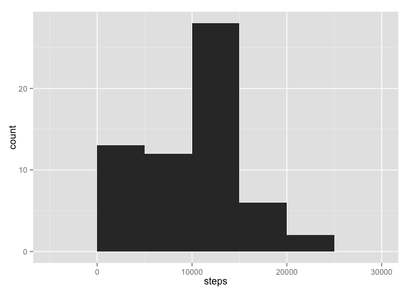
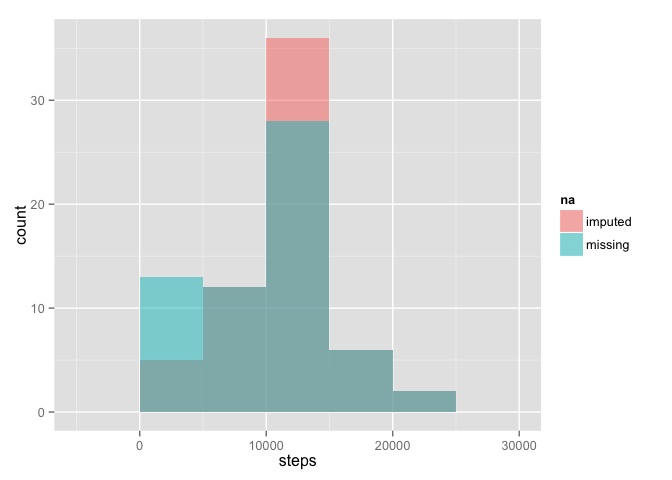
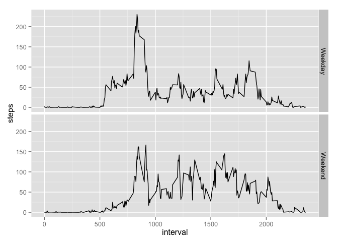

# Reproducible Research: Peer Assessment 1

## Loading and preprocessing the data


```r
setwd("~/Development/github/RepData_PeerAssessment1")
activity <- read.csv("activity.csv")
str(activity)
```

```
## 'data.frame':	17568 obs. of  3 variables:
##  $ steps   : int  NA NA NA NA NA NA NA NA NA NA ...
##  $ date    : Factor w/ 61 levels "2012-10-01","2012-10-02",..: 1 1 1 1 1 1 1 1 1 1 ...
##  $ interval: int  0 5 10 15 20 25 30 35 40 45 ...
```

```r
summary(activity)
```

```
##      steps                date          interval     
##  Min.   :  0.00   2012-10-01:  288   Min.   :   0.0  
##  1st Qu.:  0.00   2012-10-02:  288   1st Qu.: 588.8  
##  Median :  0.00   2012-10-03:  288   Median :1177.5  
##  Mean   : 37.38   2012-10-04:  288   Mean   :1177.5  
##  3rd Qu.: 12.00   2012-10-05:  288   3rd Qu.:1766.2  
##  Max.   :806.00   2012-10-06:  288   Max.   :2355.0  
##  NA's   :2304     (Other)   :15840
```

## Process the data


```r
activity$date <- as.Date(activity$date)
```

## What is mean total number of steps taken per day?

Total number of steps each day


```r
stepsPerDay <- aggregate(activity$steps, list(activity$date), sum, na.rm=TRUE)
names(stepsPerDay) <- c("date", "steps")
library(ggplot2)
ggplot(stepsPerDay, aes(x=steps)) + geom_histogram(binwidth=5000)
```

 

```r
meanSteps <- as.integer(mean(stepsPerDay$steps))
meanSteps
```

```
## [1] 9354
```

```r
medianSteps <- median(stepsPerDay$steps)
medianSteps
```

```
## [1] 10395
```

## What is the average daily activity pattern?


```r
stepsPattern <- aggregate(activity$steps, list(activity$interval), mean, na.rm=TRUE)
names(stepsPattern) <- c("time", "steps")
plot(stepsPattern, type="l", main="Average daily activity pattern")
```

 

```r
maxInterval = stepsPattern$time[which.max(stepsPattern$steps)]
```

The 5-minute interval, with on average across all days, maximum number of steps: 835. 

## Imputing missing values


```r
NAs <- sum(is.na(activity))
rows <- nrow(activity)
NAratio <- NAs/rows
```

There are 2304 missing values out of a total of 17568, or 13.1147541 %.

Strategy: fill in missing values with the mean for that 5-minute interval.


```r
means <- aggregate(steps ~ interval, data = activity, mean, na.rm=TRUE)
names(means)[2] <- "impute.steps"
activityFix <- merge(activity, means) 
activityFix$steps[is.na(activityFix$steps)] <- activityFix$impute.steps[is.na(activityFix$steps)]
activityFix$impute.steps <- NULL
str(activityFix)
```

```
## 'data.frame':	17568 obs. of  3 variables:
##  $ interval: int  0 0 0 0 0 0 0 0 0 0 ...
##  $ steps   : num  1.72 0 0 0 0 ...
##  $ date    : Date, format: "2012-10-01" "2012-11-23" ...
```

```r
summary(activityFix)
```

```
##     interval          steps             date           
##  Min.   :   0.0   Min.   :  0.00   Min.   :2012-10-01  
##  1st Qu.: 588.8   1st Qu.:  0.00   1st Qu.:2012-10-16  
##  Median :1177.5   Median :  0.00   Median :2012-10-31  
##  Mean   :1177.5   Mean   : 37.38   Mean   :2012-10-31  
##  3rd Qu.:1766.2   3rd Qu.: 27.00   3rd Qu.:2012-11-15  
##  Max.   :2355.0   Max.   :806.00   Max.   :2012-11-30
```

```r
activity$na = "missing"
activityFix$na = "imputed"
combo = rbind(activity, activityFix)
library(ggplot2)
comboPerDay = aggregate(combo$steps, list(combo$date, combo$na), sum, na.rm=TRUE)
colnames(comboPerDay) = c("date", "na", "steps")
ggplot(comboPerDay, aes(x=steps, fill=na)) + geom_histogram(position="identity", alpha=.5, binwidth=5000)
```

 

8 days had missing values for all of the intervals, which are now filled with the mean values per interval,

The mean and median shift accordingly:


```r
meanSteps
```

```
## [1] 9354
```

```r
meanSteps2 <- as.integer(mean(comboPerDay$steps[comboPerDay$na == "imputed"]))
meanSteps2
```

```
## [1] 10766
```

```r
medianSteps
```

```
## [1] 10395
```

```r
medianSteps2 <- median(comboPerDay$steps[comboPerDay$na == "imputed"])
medianSteps2
```

```
## [1] 10766.19
```

## Are there differences in activity patterns between weekdays and weekends?


```r
activityFix$date = as.Date(activityFix$date)
activityFix$weekday = ifelse(weekdays(activityFix$date) %in% c("Saturday", "Sunday"), "Weekend", "Weekday")
stepsPattern2 <- aggregate(activityFix$steps, list(activityFix$interval, activityFix$weekday), mean, na.rm=TRUE)
names(stepsPattern2) = c("interval", "weekday", "steps")
ggplot(stepsPattern2, aes(x=interval, y=steps)) + geom_line() + facet_grid(weekday ~.)
```

 
